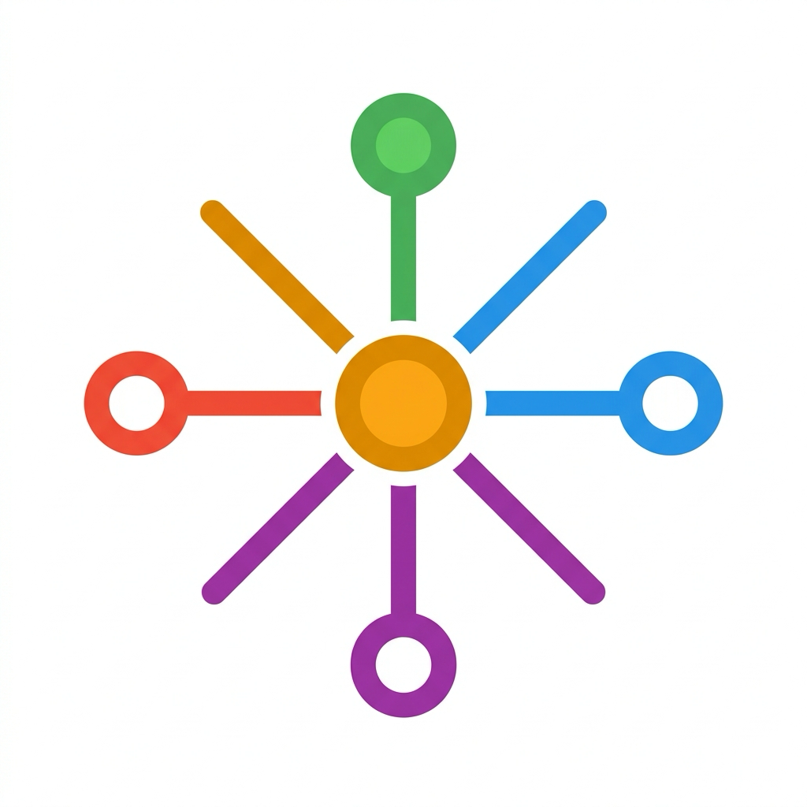

<p align="center">
  
</p>

<h1 align="center">claude-rescue</h1>

<p align="center">
  <strong>No restart. No reconfig. Call any model mid-task from inside Claude Code.</strong>
</p>

<p align="center">
  Hot-swap between <b>Claude</b>, <b>DeepSeek</b>, <b>GLM</b>, <b>Qwen</b>, <b>Kimi</b>, or any Anthropic-compatible backend — <i>within the same conversation</i>, without ever leaving your Claude Code session.
</p>

<p align="center">
  <a href="#license"></a>
  =18">
  
  
</p>

<!-- TODO: demo GIF here — ~20s showing main Claude dispatching to GLM for vision, then DeepSeek for reasoning, in one conversation -->

---

## The scenario

You ask Claude Code to refactor a module. Mid-task:

> 🖼️ Needs to read a design diagram → dispatches to `qwen3.6-plus` (vision)
> 🧠 Needs deep root-cause analysis → dispatches to `deepseek-v4-pro` (thinking mode)
> ✍️ Back to the main thread, Sonnet writes the patch.

**Three models. One conversation. Zero restarts.**

## Why this, not a router?

Every other Claude Code multi-backend tool routes the **whole session** to one alternate provider. Your main thread stops being native Claude the moment a proxy sits in front of it.

`claude-rescue` keeps the main thread on your real Claude subscription and gives you **per-call** backend selection via a subagent.

| | `claude-code-router` | `cc-switch` | Official `/model` | **`claude-rescue`** |
|---|:---:|:---:|:---:|:---:|
| Main thread stays native Claude | ❌ (proxied) | depends | ✅ | **✅** |
| Switch backend mid-conversation | ⚠️ restart | ❌ restart | ⚠️ same vendor | **✅ one prompt** |
| Different backend per subtask | ⚠️ via tag | ❌ | ❌ | **✅ built-in** |
| Subprocess isolation + logs | ❌ | ❌ | ❌ | **✅** |
| Pattern match with `codex-rescue` / `opencode-rescue` | ❌ | ❌ | ❌ | **✅** |

## Quick start

```bash
# 1. clone + symlink into Claude Code
git clone https://github.com/suharvest/claude-rescue ~/project/claude-rescue
ln -s ~/project/claude-rescue ~/.claude/plugins/local/claude-rescue

# 2. copy the template and add your favorite backends
cp ~/project/claude-rescue/scripts/sources.example.json \
   ~/project/claude-rescue/scripts/sources.json
$EDITOR ~/project/claude-rescue/scripts/sources.json

# 3. export the secrets referenced by sources.json (any method — see below)
export DEEPSEEK_API_KEY=sk-...

# 4. start Claude Code and dispatch
claude
```

Inside the session:

```
Agent(subagent_type="claude-rescue", prompt="refactor this module source=deepseek-pro")
```

That's it. The subagent spawns an isolated `claude -p` subprocess pointed at DeepSeek, streams the result back, and your main thread keeps its full context.

## Configure sources

Each source is an (env + model) combo pointing at any **Anthropic-compatible** endpoint. `${VAR}` placeholders are resolved from the runtime `process.env` — claude-rescue never reads your secret store directly.

```jsonc
{
  "default": "my-payg",
  "sources": {
    "my-payg": {
      "env": { "ANTHROPIC_API_KEY": "${ANTHROPIC_API_KEY}" },
      "model": "claude-sonnet-4-6"
    },
    "deepseek-pro": {
      "env": {
        "ANTHROPIC_BASE_URL": "https://api.deepseek.com/anthropic",
        "ANTHROPIC_AUTH_TOKEN": "${DEEPSEEK_API_KEY}"
      },
      "model": "deepseek-v4-pro"
    },
    "glm-5": {
      "env": {
        "ANTHROPIC_BASE_URL": "https://coding.dashscope.aliyuncs.com/apps/anthropic",
        "ANTHROPIC_AUTH_TOKEN": "${ALIYUN_CODINGPLAN_KEY}"
      },
      "model": "glm-5"
    }
  }
}
```

Bring secrets in however you like:

```bash
export DEEPSEEK_API_KEY=sk-...                      # plain shell
direnv allow                                         # direnv / .envrc
op run --env-file=.env.1p -- claude                  # 1Password CLI
# pass / bitwarden / vault / age — wrap however you like
```

Missing a required var? The companion fails fast with `Env var "X" is not set` — never silently hits a 401.

## Known-good backends

| Provider | `ANTHROPIC_BASE_URL` | Example models |
|---|---|---|
| Anthropic (official) | _(unset)_ | `claude-sonnet-4-6`, `claude-opus-4-7` |
| DeepSeek | `https://api.deepseek.com/anthropic` | `deepseek-v4-pro`, `deepseek-v4-flash` |
| Aliyun Model Studio CodingPlan | `https://coding.dashscope.aliyuncs.com/apps/anthropic` | `qwen3.6-plus`, `qwen3-max-2026-01-23`, `glm-5`, `glm-4.7`, `kimi-k2.5`, `MiniMax-M2.5` |
| Zhipu BigModel | `https://open.bigmodel.cn/api/anthropic` | `glm-4.7`, `glm-4.5-flash` |
| [`claude-code-router`](https://github.com/musistudio/claude-code-router) | `http://localhost:3456` | any (router maps to OpenAI / Gemini / Ollama / ...) |

Any other Anthropic-compatible endpoint works — just drop it into `sources.json`.

## Usage

From the main Claude Code thread:

```
Agent(subagent_type="claude-rescue", prompt="<task> source=<name> [model=<override>] [background]")
```

Or invoke the companion directly:

```bash
node scripts/claude-companion.mjs task "<task>" --source deepseek-pro
node scripts/claude-companion.mjs task "<task>" --source deepseek-pro --background
node scripts/claude-companion.mjs list-sources
node scripts/claude-companion.mjs status <job-id>
node scripts/claude-companion.mjs result <job-id>
node scripts/claude-companion.mjs watch [<job-id>] [--pretty] [--list] [--cwd <dir>]
```

### Nesting

Nesting is **disabled by default** — a child run cannot dispatch another `claude-rescue`. This is enforced at two layers:

1. A `PreToolUse` hook denies `Agent(subagent_type=claude-rescue)` and Bash re-invocations of the companion when `CLAUDE_RESCUE_DEPTH > 0`.
2. The companion runtime's `assertDepthOk()` is a backstop for raw CLI callers that bypass Claude Code.

Operator opt-in: `CLAUDE_RESCUE_ALLOW_NESTING=1` (or raise `CLAUDE_RESCUE_MAX_DEPTH` for finer control). The current depth is exposed to each child via `CLAUDE_RESCUE_DEPTH` and recorded in `jobs/<id>/meta.json` for `--background` runs.

### Observability — where to look

There are **two distinct paths**, and conflating them is the #1 source of "is it still alive?" confusion. Don't poll the wrong one.

| You ran… | Live record lives at | Has `jobs/<id>/meta.json`? |
| --- | --- | --- |
| `Agent(subagent_type=claude-rescue, ...)` (foreground, the default) | `~/.claude/projects/<slug>/<sessionId>/subagents/agent-*.jsonl` | **No** |
| `node claude-companion.mjs task ... --background` | `~/.claude/plugins/data/claude-rescue/jobs/<id>/{stdout.log,meta.json}` | Yes |

`<slug>` is your `cwd` with `/` replaced by `-`. The subagent JSONL is Claude Code's native transcript and is the authoritative live record for the foreground path — there is no companion job entry for it.

**Liveness signals (in order of trustworthiness):**

1. mtime of the active file (subagent JSONL or `stdout.log`) — recent write = alive
2. `node claude-companion.mjs status <jobId> --liveness` for background jobs (reads `stdout.log` mtime, not pid)
3. `meta.pid` is the **task-worker** pid, *not* the grandchild `claude --print`. Don't infer aliveness from `kill -0 meta.pid` alone — the worker can be reaped while the detached claude grandchild keeps running.

**One command for both paths — `watch`:**

```bash
# Tail the freshest subagent transcripts for the current cwd (foreground path)
node scripts/claude-companion.mjs watch

# Pretty-print events (tool_use / tool_result / text / thinking) instead of raw JSONL
node scripts/claude-companion.mjs watch --pretty

# Just list available transcripts with age, don't follow
node scripts/claude-companion.mjs watch --list

# Tail a specific background job's stdout.log
node scripts/claude-companion.mjs watch <jobId>

# Override which project to watch
node scripts/claude-companion.mjs watch --cwd /path/to/other/repo --pretty
```

## How it works

```
main Claude Code (your subscription, native)
        │
        ▼  Agent(subagent_type="claude-rescue", prompt="... source=X")
┌──────────────────┐
│ claude-rescue.md │  thin forwarder subagent
└────────┬─────────┘
         │  Bash: node claude-companion.mjs task ...
         ▼
┌──────────────────┐
│ claude-companion │  loads source from sources.json
│  (Node, ~450 LOC)│  resolves ${VAR} from process.env
│                  │  strips parent ANTHROPIC_* from env
└────────┬─────────┘  spawns fresh `claude -p` with chosen env + model
         ▼
┌──────────────────┐
│  claude -p       │  ← talks to YOUR chosen backend
│  --model X ...   │    (subscription stays untouched)
└──────────────────┘
```

## Status

**MVP → v1.0.** End-to-end working with full lifecycle support: background jobs, cancel, per-session tracking, hooks, and slash commands. See [GAPS.md](GAPS.md) for remaining roadmap items vs. the reference plugins.

### What ships now

- **Hooks**: Stop, PostToolUse, SessionStart, SessionEnd (full lifecycle integration)
- **Slash commands**: `/rescue`, `/rescue-status`, `/rescue-result`, `/rescue-cancel`, `/rescue-setup`
- **Background jobs**: Fire-and-return with job tracking; cancel via PID or slash command
- **Foreground mode**: Stream-json renderer with pretty output
- **`--resume` passthrough**: Chain follow-up prompts to previous session
- **Per-session job tracking**: Automatic cleanup on SessionEnd
- **Multi-backend routing**: GLM-5, Qwen, DeepSeek, Kimi, MiniMax, pay-as-you-go Claude, any Anthropic-compatible endpoint

## Acknowledgements

- Architecture pattern adapted from [`openai-codex/codex`](https://github.com/openai/codex) (the Claude Code `codex-rescue` plugin) and [`tasict/opencode-plugin-cc`](https://github.com/tasict/opencode-plugin-cc) (the `opencode-rescue` plugin) — thin forwarder subagent + Node companion runtime.
- Inspired by the "orchestrate on one model, execute elsewhere" pattern emerging in multi-model agent stacks.

## License

[MIT](LICENSE) © 2026 harvest
